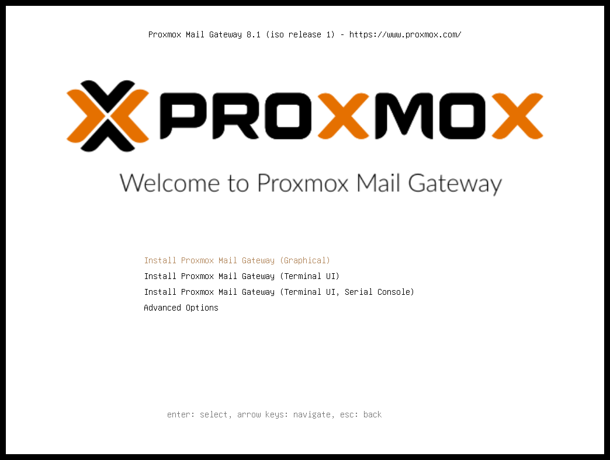
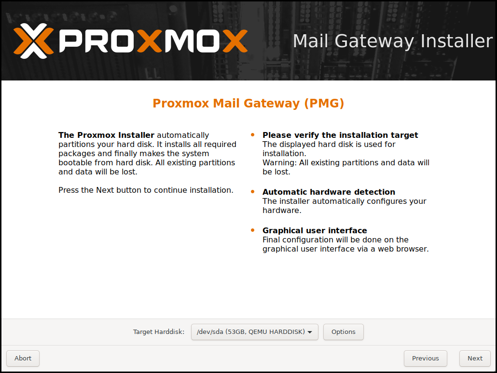
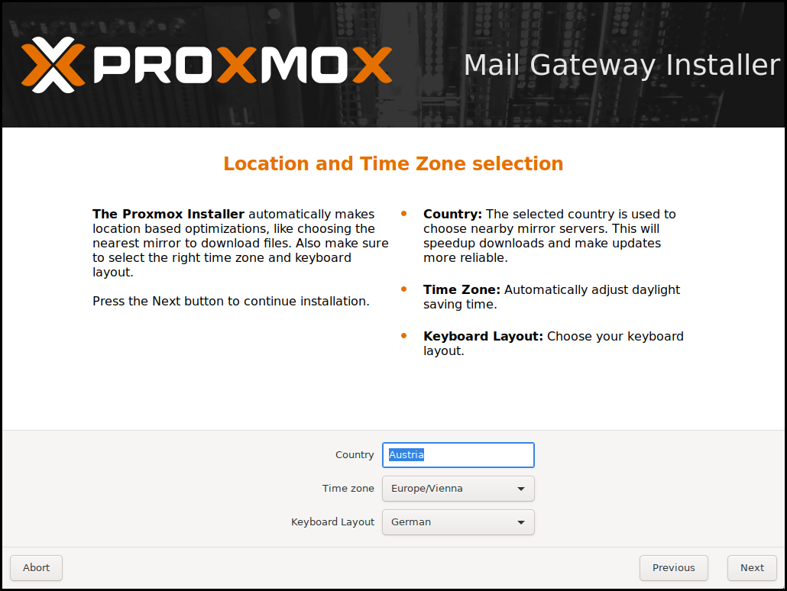
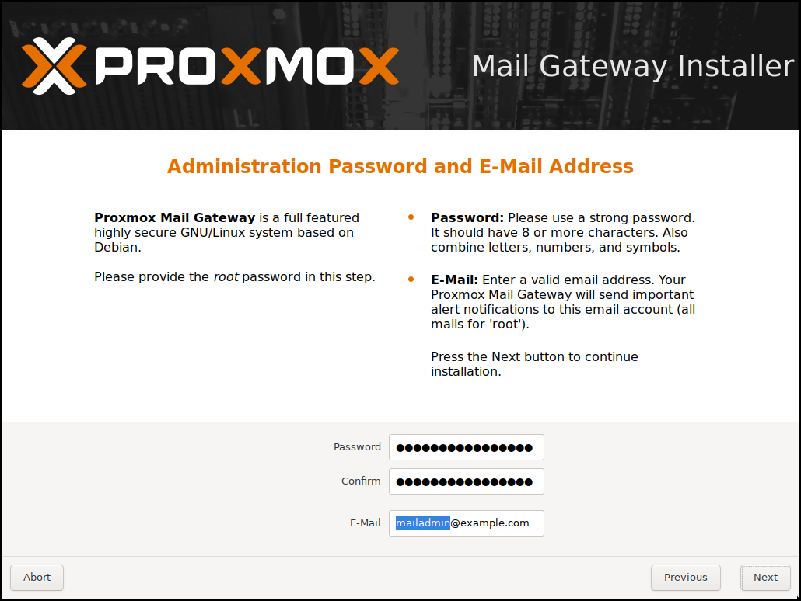
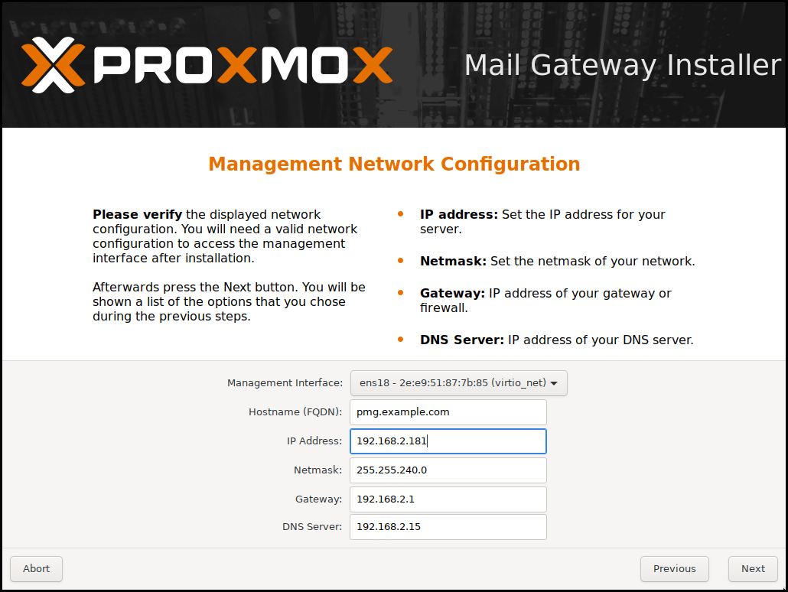
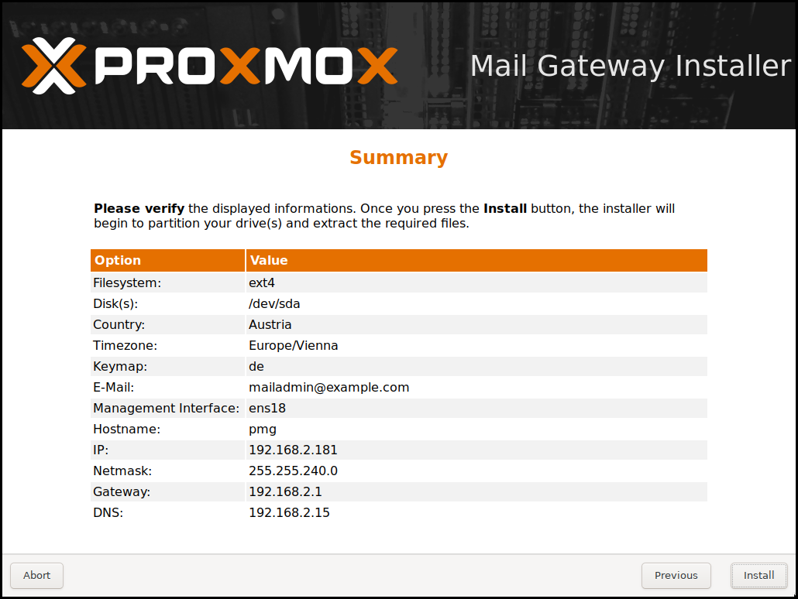
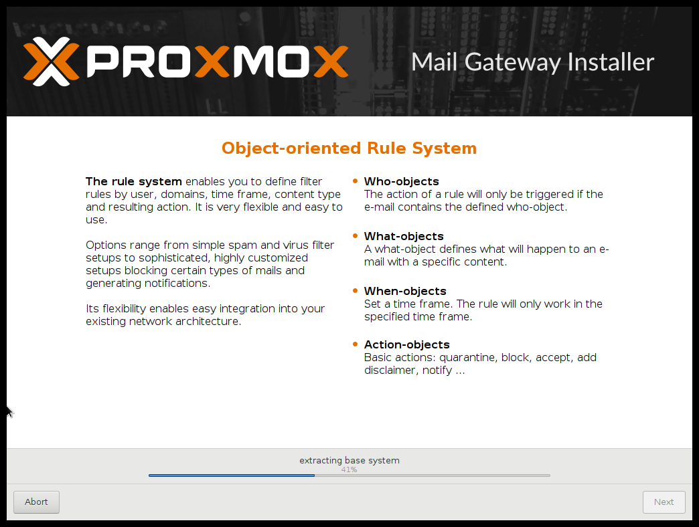

Installation
============

{pmg} is based on Debian. This is why the install disk images (ISO files)
provided by Proxmox include a complete Debian system as well as all necessary
{pmg} packages.

TIP: See the xref:faq-support-table[support table in the FAQ] for the
relationship between {pmg} releases and Debian releases.

The installer will guide through the setup, allowing you to partition the local
disk(s), apply basic system configurations (for example, timezone, language,
network) and install all required packages. This process should not take more
than a few minutes. Installing with the provided ISO is the recommended method
for new and existing users.

Alternatively, {pmg} can be installed on top of an existing Debian system. This
option is only recommended for advanced users because detailed knowledge about
{pmg} is required.

include::pmg-installation-media.adoc[]

[[pmg_install_iso]]
Using the {pmg} Installation CD-ROM
-----------------------------------

The installer ISO image includes the following:

* Complete operating system (Debian Linux, 64-bit)

* The {pmg} installer, which partitions the hard drive(s) with ext4,
  XFS or ZFS and installs the operating system

* Linux kernel

* Postfix MTA, ClamAV, Spamassassin and the {pmg} toolset

* Web-based management interface for using the toolset

Please insert the xref:installation_prepare_media[prepared installation media]
(for example, USB flash drive or CD-ROM) and boot from it.

TIP: Make sure that booting from the installation medium (for example, USB) is
enabled in your servers firmware settings.

After choosing the correct entry (for example, Boot from USB) the {pmg} menu
will be displayed, and one of the following options can be selected:

Install {pmg}::

Start normal installation.

Install {pmg} (Debug mode)::

Start installation in debug mode. This opens a shell console at various stages
throughout the installation, so that you can debug issues, if something goes
wrong. You can press `CTRL-D` to exit the debug console and continue the
installation. This option is mostly for developers and not meant for general
use.

Rescue Boot::

This option allows you to boot an existing installation. It searches
all attached hard disks and, if it finds an existing installation,
boots directly into that disk using the existing Linux kernel. This
can be useful if there are problems with the boot block (grub), or the
BIOS is unable to read the boot block from the disk.

Test Memory::

Runs `memtest86+`. This is useful to check if your memory is
functional and error free.

You normally select *Install {pmg}* to start the installation.

The first step is to read our EULA (End User License Agreement). Following
this, you can select the target hard disk(s) for the installation.

CAUTION: By default, the whole server is used and all existing data is removed.
Make sure there is no important data on the server before proceeding with the
installation.

The `Options` button lets you select the target file system, which
defaults to `ext4`. The installer uses LVM if you select
`ext4` or `xfs` as a file system, and offers additional options to
restrict LVM space (see <<advanced_lvm_options,below>>)

If you have more than one disk, you can also use ZFS as a file system.
ZFS supports several software RAID levels, which is particularly useful
if you do not have a hardware RAID controller. The `Options` button
lets you choose the ZFS RAID level and select which disks will be used.

The next page asks for basic configuration options like your
location, timezone, and keyboard layout. The location is used to
select a nearby download server, in order to increase the speed of updates.
The installer is usually able to auto-detect these settings, so you only need to
change them in rare situations when auto-detection fails, or when you want to
use a keyboard layout not commonly used in your country.

You then need to specify an email address and the superuser (root)
password. The password must have at least 5 characters, but we highly
recommend to use stronger passwords - here are some guidelines:

- Use a minimum password length of 12 to 14 characters.

- Include lowercase and uppercase alphabetic characters, numbers and symbols.

- Avoid character repetition, keyboard patterns, dictionary words, letter or
  number sequences, usernames, relative or pet names, romantic links (current
  or past) and biographical information (e.g., ID numbers, ancestors' names or
  dates).

It is sometimes necessary to send notification to the system administrator, for
example:

- Information about available package updates.

- Error messages from periodic cron jobs.

All those notification mails will be sent to the specified email address.

The next step is the network configuration. Please note that you can use either
IPv4 or IPv6 here, but not both. If you want to configure a dual stack node,
you can easily do that after the installation.

When you press `Next`, you will see an overview of your entered configuration.
Please re-check every setting, you can still use the `Previous` button to go
back and edit any settings.

After clicking `Install`, the installer will begin to format and copy packages
to the target disk(s).

Copying the packages usually takes several minutes. When this is
finished, you can reboot the server.

Further configuration is done via the {pmg} web interface:

[thumbnail="pmg-gui-login-window.png"]

. Point your browser to the IP address given during the installation
(https://youripaddress:8006).

. Log in and upload your subscription key.
+
NOTE: The default login is "root", and the password is the one chosen during the
installation.

. Check the IP configuration and hostname.

. Check the timezone.

. Check your xref:firewall_settings[Firewall settings].

. Configure {pmg} to forward the incoming SMTP traffic to your mail
server ('Configuration/Mail Proxy/Default Relay') - 'Default
Relay' is your email server.

. Configure your email server to send all outgoing messages through
your {pmg} ('Smart Host', port 26 by default).

For detailed deployment scenarios see chapter
xref:chapter_deployment[Planning for Deployment].

After the installation, you have to route all your incoming and
outgoing email traffic to {pmg}. For incoming traffic, you
have to configure your firewall and/or DNS settings. For outgoing
traffic you need to change the existing email server configuration.

[[advanced_lvm_options]]
Advanced LVM Configuration Options
~~~~~~~~~~~~~~~~~~~~~~~~~~~~~~~~~~

The installer creates a Volume Group (VG) called `pmg`, and additional
Logical Volumes (LVs) called `root` and `swap`. The size of
those volumes can be controlled with:

`hdsize`::

Defines the total disk size to be used. This way you can save free
space on the disk for further partitioning (i.e. for an additional PV
and VG on the same disk that can be used for LVM storage).

`swapsize`::

Defines the size of the `swap` volume. The default is the size of the
installed memory. The minimum is 4 GB and the maximum is 8 GB. The resulting
value cannot be greater than `hdsize/8`.

`minfree`::

Defines the amount of free space that should be left in the LVM volume group
`pmg`. With more than 128GB storage available, the default is 16GB, otherwise
`hdsize/8` will be used.
+
NOTE: LVM requires free space in the VG for snapshot creation (not
required for lvmthin snapshots).

ZFS Performance Tips
~~~~~~~~~~~~~~~~~~~~

ZFS uses a lot of memory, so it is best to add additional RAM if you
want to use ZFS. A good calculation is 4GB plus 1GB RAM for each TB
RAW disk space.

ZFS also provides the ability to use a fast SSD drive as write cache. The
write cache is called the ZFS Intent Log (ZIL). You can add that after
the installation using the following command:

 zpool add <pool-name> log </dev/path_to_fast_ssd>

[[pmg_install_on_debian]]
Install {pmg} on Debian
-----------------------

{pmg} ships as a set of Debian packages, so you can install it
on top of a normal Debian installation. After configuring the
xref:pmg_package_repositories[package repositories], you need to run:

[source,bash]
----
apt update
apt install proxmox-mailgateway
----

Installing on top of an existing Debian installation seems easy, but
it assumes that you have correctly installed the base system, and you
know how you want to configure and use the local storage. Network
configuration is also completely up to you.

NOTE: In general, this is not trivial, especially when you use LVM or
ZFS.

[[pmg_install_on_debian_container]]
Install {pmg} as a Linux Container Appliance
--------------------------------------------

{pmg} can also run inside a Debian-based LXC
instance. In order to keep the set of installed software, and thus the
necessary updates minimal, you can use the `proxmox-mailgateway-container`
meta-package. This does not depend on any Linux kernel, firmware, or components
used for booting from bare-metal, like grub2.

A ready-to-use appliance template is available through the `mail` section of the
https://www.proxmox.com/proxmox-ve[Proxmox VE] appliance manager, so if you
already use Proxmox VE, you can set up a {pmg} instance in minutes.

NOTE: It's recommended to use a static network configuration. If DHCP must be
used, ensure that the container always leases the same IP, for example, by
reserving one with the container's network MAC address.

Additionally, you can install this on top of a container-based Debian
installation. After configuring the
xref:pmg_package_repositories[package repositories], you need to run:

[source,bash]
----
apt update
apt install proxmox-mailgateway-container
----

[[pmg_package_repositories]]
Package Repositories
--------------------

All {debian} based systems use
https://en.wikipedia.org/wiki/Advanced_Packaging_Tool[APT] as a package
management tool. The list of repositories is defined in
`/etc/apt/sources.list` and `.list` files found inside
`/etc/apt/sources.d/`. Updates can be installed directly using
`apt`, or via the GUI.

Apt `sources.list` files list one package repository per line, with
the most preferred source listed first. Empty lines are ignored, and a
`#` character anywhere on a line marks the remainder of that line as a
comment. The information available from the configured sources is
acquired by `apt update`.

.File `/etc/apt/sources.list`
----
# basic Debian repositories:
deb http://ftp.debian.org/debian bullseye main contrib
deb http://ftp.debian.org/debian bullseye-updates main contrib

# security updates
deb http://security.debian.org/debian-security bullseye-security main contrib

# Proxmox Mail Gateway repo required too - see below!
----

In addition, {pmg} provides three different package repositories.

{pmg} Enterprise Repository
~~~~~~~~~~~~~~~~~~~~~~~~~~~

This is the default, stable and recommended repository, available for
all {pmg} subscription users. It contains the most stable packages,
and is suitable for production use. The `pmg-enterprise` repository is
enabled by default:

.File `/etc/apt/sources.list.d/pmg-enterprise.list`
----
deb https://enterprise.proxmox.com/debian/pmg bullseye pmg-enterprise
----

As soon as updates are available, the `root@pam` user is notified via
email about the newly available packages. From the GUI, the change-log of
each package can be viewed (if available), showing all details of the
update. Thus, you will never miss important security fixes.

Please note that you need a valid subscription key to access this
repository. We offer different support levels, which you can find further
details about at {pricing-url}.

NOTE: You can disable this repository by commenting out the above line
using a `#` (at the start of the line). This prevents error messages,
if you do not have a subscription key. Please configure the
`pmg-no-subscription` repository in this case.

{pmg} No-Subscription Repository
~~~~~~~~~~~~~~~~~~~~~~~~~~~~~~~~

As the name suggests, you do not need a subscription key to access
this repository. It can be used for testing and non-production
use. It's not recommended to use this on production servers, as these
packages are not always heavily tested and validated.

We recommend configuring this repository in `/etc/apt/sources.list`.

.File `/etc/apt/sources.list`
----
deb http://ftp.debian.org/debian bullseye main contrib
deb http://ftp.debian.org/debian bullseye-updates main contrib

# security updates
deb http://security.debian.org/debian-security bullseye-security main contrib

# PMG pmg-no-subscription repository provided by proxmox.com,
# NOT recommended for production use
deb http://download.proxmox.com/debian/pmg bullseye pmg-no-subscription
----

{pmg} Test Repository
~~~~~~~~~~~~~~~~~~~~~

Finally, there is a repository called `pmgtest`. This contains the
latest packages, and is heavily used by developers to test new
features. As with before, you can configure this using
`/etc/apt/sources.list` by adding the following line:

.sources.list entry for `pmgtest`
----
deb http://download.proxmox.com/debian/pmg bullseye pmgtest
----

WARNING: the `pmgtest` repository should only be used
for testing new features or bug fixes.

SecureApt
~~~~~~~~~

We use GnuPG to sign the `Release` files inside these repositories,
and APT uses these signatures to verify that all packages are from a
trusted source.

The key used for verification is already installed, if you install from
our installation CD. If you install via another means, you can manually
download the key with:

----
 # wget https://enterprise.proxmox.com/debian/proxmox-release-bullseye.gpg -O /etc/apt/trusted.gpg.d/proxmox-release-bullseye.gpg
----

Verify the checksum afterwards with the `sha512sum` CLI tool:

----
# sha512sum /etc/apt/trusted.gpg.d/proxmox-release-bullseye.gpg
7fb03ec8a1675723d2853b84aa4fdb49a46a3bb72b9951361488bfd19b29aab0a789a4f8c7406e71a69aabbc727c936d3549731c4659ffa1a08f44db8fdcebfa /etc/apt/trusted.gpg.d/proxmox-release-bullseye.gpg
----

or the `md5sum` CLI tool:

----
# md5sum /etc/apt/trusted.gpg.d/proxmox-release-bullseye.gpg
bcc35c7173e0845c0d6ad6470b70f50e /etc/apt/trusted.gpg.d/proxmox-release-bullseye.gpg
----

Other Repository Sources
~~~~~~~~~~~~~~~~~~~~~~~~

Certain software cannot be made available in the `main` and `contrib`
areas of the {debian} archives, since it does not adhere to the Debian
Free Software Guidelines (DFSG). These are distributed in the
{debian_nonfree_archive_area}. For {pmg} two packages from the `non-free` area
are needed in order to support the RAR archive format:

* `p7zip-rar` for matching xref:pmg_mailfilter_what[Archive Objects] in the
  xref:chapter_mailfilter[Rule system]

* `libclamunrar` for detecting viruses in RAR archives.

.Additional sources.list entry for `non-free`
----
deb http://deb.debian.org/debian/ bullseye non-free
deb http://security.debian.org/debian-security bullseye-security non-free
deb http://deb.debian.org/debian/ bullseye-updates non-free
----

Following this, you can install the required packages with:

----
apt update
apt install libclamunrar p7zip-rar
----
